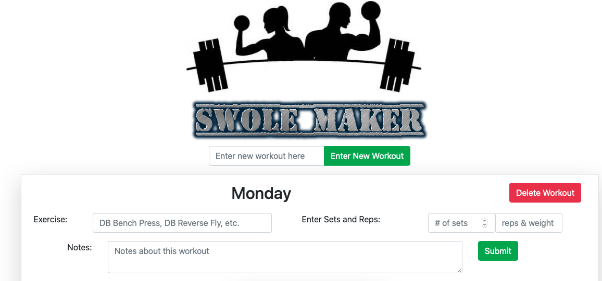
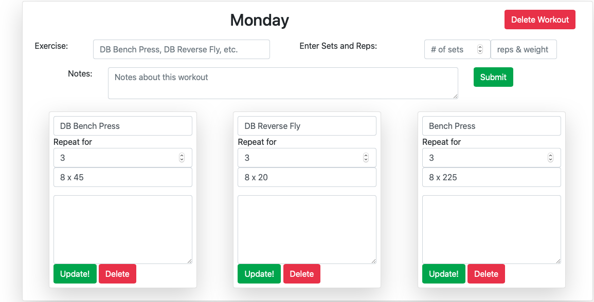

# Workout Tracker

 

---

## Description

This app is a workout tracker created with a Mongo database, Mongoose schema and handles routes with Express, along with and interactive frontend built with Bootstrap. This is also built with and MVC design.

---

## Table of Contents

1. [ Description ](#description)
2. [ Visuals ](#visuals)
3. [ Demo](#demo)
4. [ Usage ](#usage)
5. [ License ](#license)
6. [ Contributing ](#contributing)
7. [ Questions ](#questions)

---

## Visuals

Screenshot of Project

---

## Demo

Checkout the [demo page](https://swoletracker.herokuapp.com) to see Workout Tracker in action.

---

## Usage

1. When the app is running. Add a workout and click enter new workout

2. Next enter the exercise, sets, reps, weight and any notes and click submit.

3. Workout!!!

4. During workout update the exercise to track accurate results.

---

## License

Copyright (c) 2020, Andrew Crow. (MIT License)

---

## Contributing

We are currently not allowing outside contributors to this project, but check back because things can change.

---

## Questions

If you have questions you can reach me here:

Email: andrew@crow.me

GitHub: [Github Profile](https://github.com/crowandrew)

---
